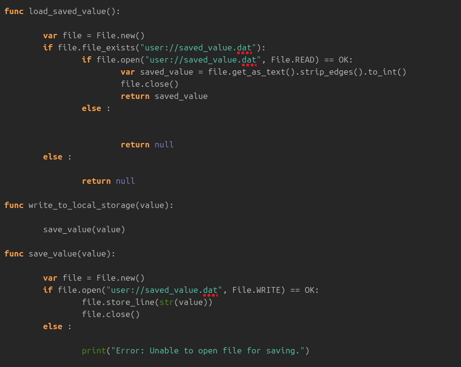
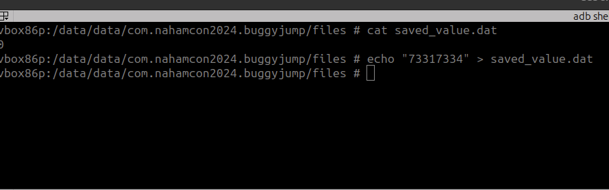
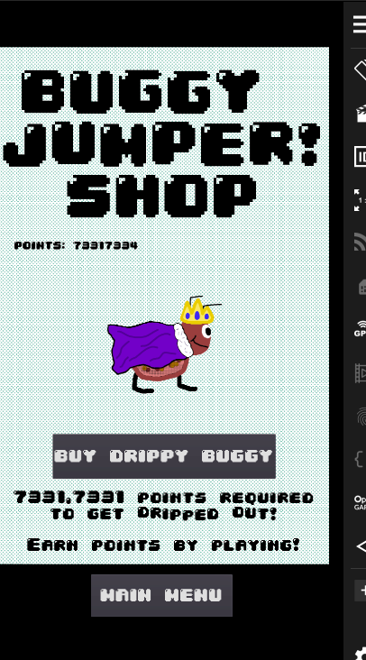
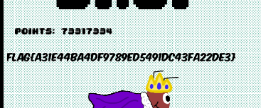

NahamCon CTF 2024

*Buggy really wants the drip in the shop... Can you buy it for them?*

## Writeup
From the Buggy Jumper-1 I decompiled .gdc files and I also decompile the global.gdc outside the scripts folder (_which was not shown in the buggy jumper 1 writeup_).

Upon reviewing the code in global.gd, we can see that data is being saved without encrypting the values.

Using ADB shell to modify the value of `saved_value.dat` in my [Genymotion](https://www.genymotion.com/product-desktop/download/) android emulator where I installed the `com.nahamcon2024.buggyjumper.apk`.

**Flag obtained after buying the drippy buggy in the BuggyJumper App**

